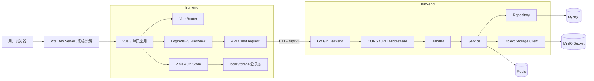
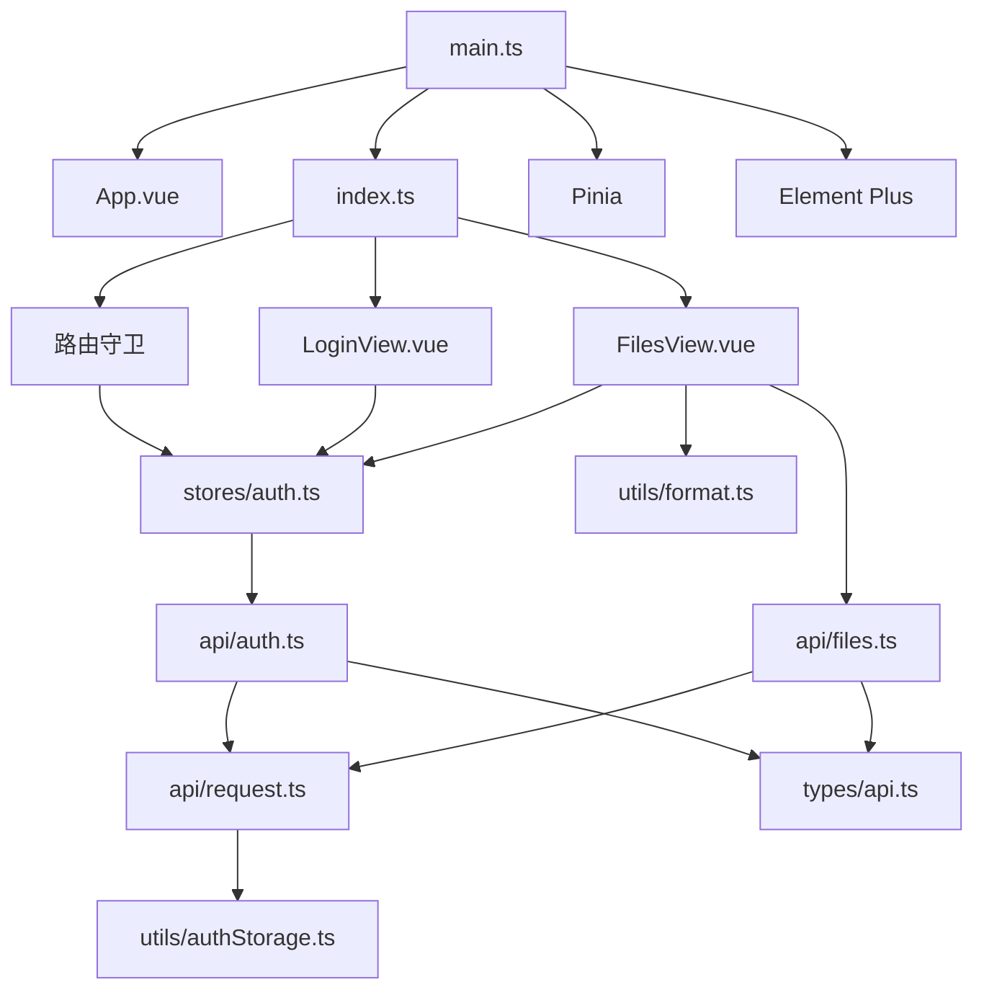
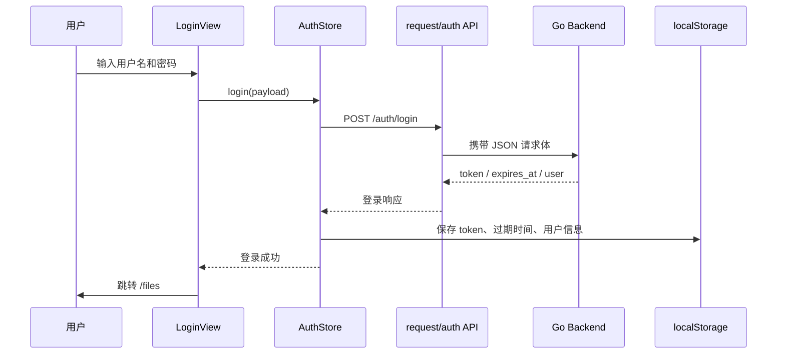
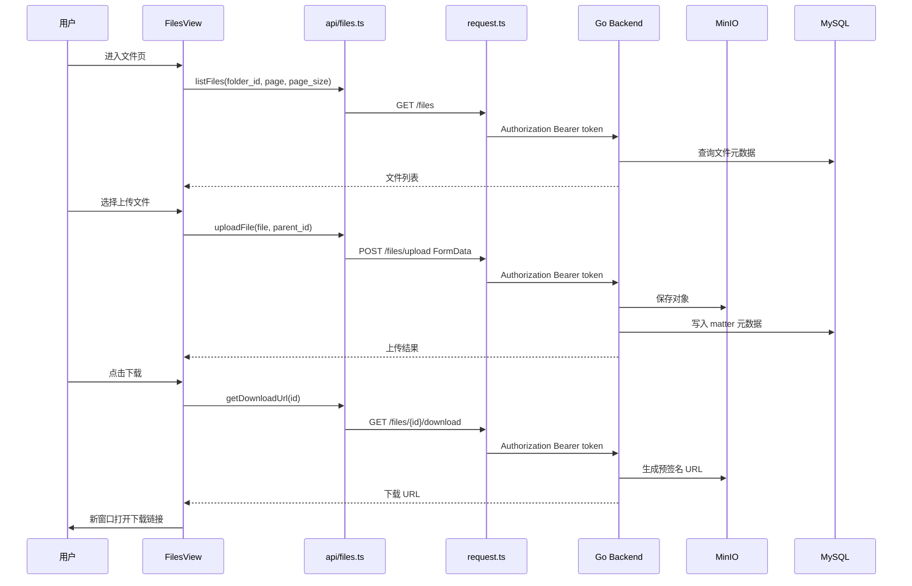

# 前端架构图

## 整体架构

## 前端模块关系

## 登录态流转

## 文件操作流转

## 关键设计点

- 前端只负责交互、状态与 API 编排，不直接关心 MySQL、Redis、MinIO 等基础设施。
- `request.ts` 是前端访问后端的统一入口，集中处理 API 基础路径、JSON 头、token 注入和错误提示。
- `stores/auth.ts` 是登录态唯一来源，页面通过 Store 判断是否已认证。
- 路由守卫负责保护 `/files`，未登录用户会被引导到 `/login`。
- 文件列表、上传、下载、删除、重命名都通过后端鉴权接口完成，后端继续保证用户只能操作自己的文件。
